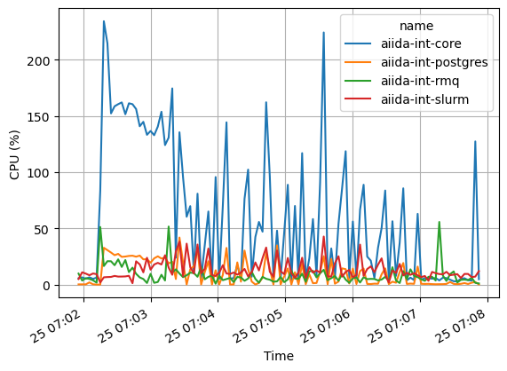
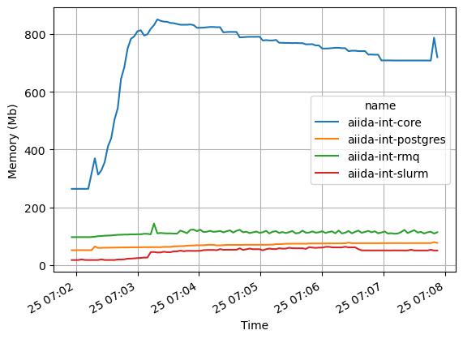
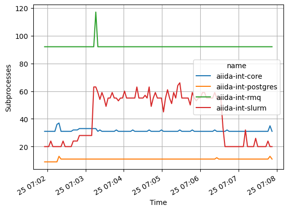
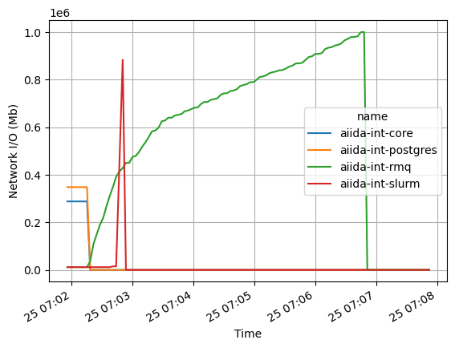
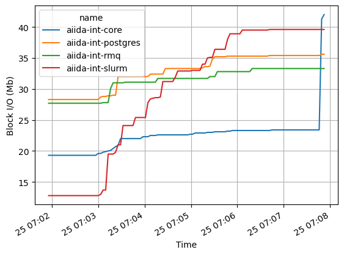
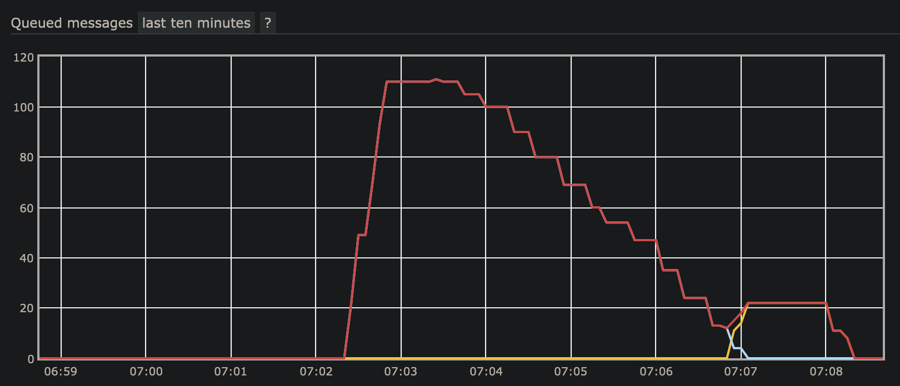

# aiida-integration-tests

A repository for creating a reproducible AiiDA system, primarily for testing integration and performance.

## Setup

Simply clone this repository and run Docker Compose.

Before running Docker, it is advised to modify `docker-compose.yml`, by replacing `checkout: "develop"` with a specific commit from <https://github.com/aiidateam/aiida-core/commits/develop>.

```console
$ docker compose up --build -d
```

Will start-up a network with four containers:

- `aiida-int-postgres`: The database server (PostgreSQL)
- `aiida-int-rmq`: The message broker client (RabbitMQ)
- `aiida-int-slurm`: An example compute server, with SLURM job scheduler
- `aiida-int-core`: The AiiDA control node
  - By default, it will install the latest `develop` branch from the aiida-core Github repository.
    In order to select a specific tag or commit, edit the `config` variable in `docker-compose.yml`

You can interact with the containers via the terminal or also [attach VS Code](https://marketplace.visualstudio.com/items?itemName=ms-azuretools.vscode-docker).

Logging into the `aiida-int-core` container, you can then run the configurations to create a profile, connected to the postgres and rabbitmq servers, and computers connected locally and to the slurm server:

```console
$ docker exec -it aiida-int-core /bin/bash
root@xxx:~# aiida_config/run_all.sh
root@xxx:~# verdi daemon start 2
```

This will also create codes (local/slurm) for the included `aiida-sleep` plugin, providing a `SleepCalcJob`,
that simply runs the Unix `sleep` command, and a `SleepWorkChain` that calls `n` `SleepCalcJob` children.

You can tear down the network at any point using:

```console
$ docker compose down -v
```

## Running integration tests

```console
root@xxx:~# aiida-sleep calc -n 1 -t 10 -p 10000 -o 10000 -a 10000
setting up and running calculation 1
uuid: d3dfe5e8-e622-451f-93d3-a6719aa63839 (pk: 56) (aiida.calculations:sleep)
root@xxx:~# aiida-sleep workchain -nw 1 -nc 10 -t 10 -p 10000 -o 10000 -a 10000
setting up and running workchain 1
uuid: 32015a78-3593-4479-8129-36aba1d71a39 (pk: 65) (aiida.workflows:sleep)
```

Note:

- `-p 10000` is an input "payload" `orm.Dict` with 10,000 key/values,
that is written as a JSON file to upload
- `-o 10000` is a parsed output `orm.Dict` with 10,000 key/values.
- `-a 10000` is a parsed output `orm.ArrayData`, storing `numpy.ones(10000)`.
- Use either `-c sleep@local` or `-c sleep@slurm` to set the code
- Use `--submit` to submit the calculation/workchain to the daemon, rather than running directly

```console
# verdi process show 56
Property     Value
-----------  ------------------------------------
type         SleepCalculation
state        Finished [0]
pk           56
uuid         d3dfe5e8-e622-451f-93d3-a6719aa63839
label
description
ctime        2021-01-28 15:57:00.187913+00:00
mtime        2021-01-28 15:57:38.049898+00:00
computer     [2] slurm

Inputs      PK  Type
--------  ----  ------
code         2  Code
payload     55  Dict
time        54  Int

Outputs          PK  Type
-------------  ----  ----------
out_array        61  ArrayData
out_dict         60  Dict
remote_folder    57  RemoteData
result           59  Bool
retrieved        58  FolderData

# verdi process show 65
Property     Value
-----------  ------------------------------------
type         SleepWorkChain
state        Finished [0]
pk           65
uuid         32015a78-3593-4479-8129-36aba1d71a39
label
description
ctime        2021-01-28 15:59:47.348629+00:00
mtime        2021-01-28 16:00:43.818435+00:00
computer     [2] slurm

Inputs       PK    Type
-----------  ----  ------
calcjob
    code     2     Code
    time     62    Int
    payload  63    Dict
children     64    Int

Outputs         PK    Type
--------------  ----  ------
results
    calcjob_1   96    Bool
    calcjob_2   99    Bool
    calcjob_3   102   Bool
    calcjob_4   105   Bool
    calcjob_5   108   Bool
    calcjob_6   111   Bool
    calcjob_7   114   Bool
    calcjob_8   117   Bool
    calcjob_9   120   Bool
    calcjob_10  123   Bool

Called      PK  Type
--------  ----  ----------------
CALL        66  SleepCalculation
CALL        67  SleepCalculation
CALL        68  SleepCalculation
CALL        69  SleepCalculation
CALL        70  SleepCalculation
CALL        71  SleepCalculation
CALL        72  SleepCalculation
CALL        73  SleepCalculation
CALL        74  SleepCalculation
CALL        75  SleepCalculation
```

You can also call them from an ipython shell:

```python
root@xxx:~# verdi shell
In [1]: from aiida_plugin.cli import run_calc, run_workchain
In [2]: run_workchain()
Out[2]: <WorkChainNode: uuid: 122b158c-0408-406f-8a7b-33fa9ba30bf1 (pk: 134) (aiida.workflows:sleep)>
```

## Monitoring resource usage

You can monitor the resources used by each container using:

```console
$ docker stats
CONTAINER ID   NAME                 CPU %     MEM USAGE / LIMIT     MEM %     NET I/O           BLOCK I/O         PIDS
f5b693b71c51   aiida-int-core       3.33%     388.3MiB / 1.942GiB   19.53%    10MB / 5.67MB     20.1MB / 11.1MB   30
ceda3a229762   aiida-int-postgres   0.10%     55.55MiB / 1.942GiB   2.79%     5.09MB / 9.54MB   23.7MB / 82.7MB   11
ef718edadb6e   aiida-int-rmq        56.18%    98.17MiB / 1.942GiB   4.94%     160kB / 157kB     25.5MB / 946kB    92
b6840be9fb97   aiida-int-slurm      6.25%     20.26MiB / 1.942GiB   1.02%     414kB / 319kB     5.05MB / 815kB    20
```

or log to a CSV file (every `i` seconds):

```console
$ ./docker_stats.py -o docker-stats.csv -i 1
```

Then to plot a column (requires pandas+matplotlib):

```console
$ ./docker_stats.py -o docker-stats.csv -p cpu_percent -e png
```

You can also access the RabbitMQ management console via http://localhost:15673 (user: guest, password: guest).


## Example

Using aiida-core commit `61e48d7a3dac0bc9956f8ac34b8e3cc19db1fc3e` (Tue Jan 19 21:12:23 2021 +0100)

After starting the containers and 2 AiiDA daemons, this submits 10 workchains, which each submit 10 calculations to the SLURM server:

```console
root@47f1194658ca:~# aiida-sleep workchain -nw 10 -nc 10 -t 10 -p 10000 -o 10000
uuid: 0e579aec-7659-4182-bb5f-1ef25f7ac975 (pk: 7) (aiida.workflows:sleep)
uuid: cceb3b1a-d696-481a-9f5e-051c715bc50a (pk: 12) (aiida.workflows:sleep)
uuid: a3b74c88-a6af-4d5e-9e6b-72dadfc38aa7 (pk: 19) (aiida.workflows:sleep)
uuid: e00a55d2-b1c6-4390-9cfb-be336d9c33ec (pk: 27) (aiida.workflows:sleep)
uuid: 50cf69ac-7cb6-49e7-a7f7-ef4500f784f2 (pk: 36) (aiida.workflows:sleep)
uuid: db333ebe-abdd-4e30-86f4-a86cd3febd9f (pk: 44) (aiida.workflows:sleep)
uuid: b969dafb-3582-44c7-9742-5688e1c05e81 (pk: 53) (aiida.workflows:sleep)
uuid: b22bbbe7-ddc5-4cd7-a0e2-83323f9a7158 (pk: 61) (aiida.workflows:sleep)
uuid: 42baba78-d2d5-4fee-a45c-4b52676e5a1f (pk: 67) (aiida.workflows:sleep)
uuid: 2ec36a6c-36cc-49d1-9c03-29044a724a4e (pk: 74) (aiida.workflows:sleep)
root@47f1194658ca:~# verdi process list
PK    Created    Process label    Process State    Process status
----  ---------  ---------------  ---------------  ----------------

Total results: 0

Info: last time an entry changed state: 51s ago (at 07:06:59 on 2021-01-25)
```







RMQ Management

